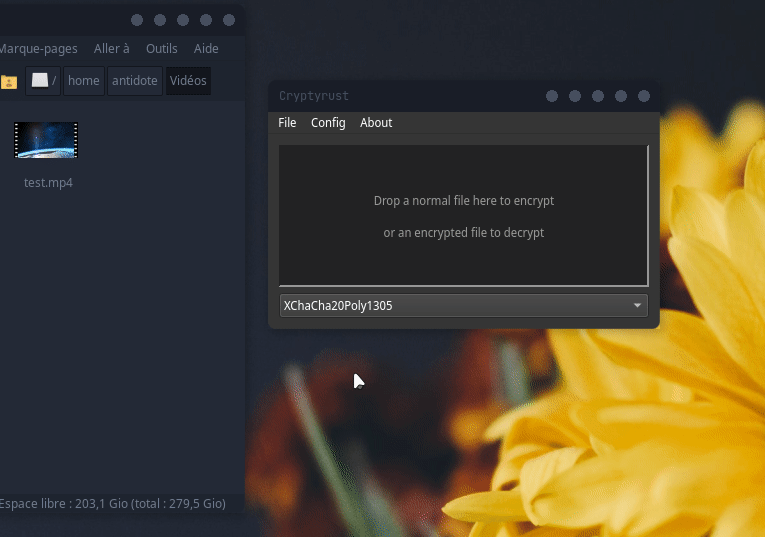

[](https://ci.appveyor.com/project/Antidote1911/cryptyrust/branch/master)
[](https://opensource.org/licenses/GPL-3.0)


# Cryptyrust
**Simple cross-platform drag-and-drop gui and cli file encryption.**<br/>
Latest Windows x64 release is [here](https://github.com/Antidote1911/cryptyrust/releases/latest).



## Usage for CLI:

Exemples :
You can choose algorithm encryption with `-a aesgcm` for aes256Gcm `-a chacha` for XChacha20Poly1305, or `-a aesgcmsiv` for aes256GcmSiv. If not specified, cryptyrust use XChacha20Poly1305. Decryption automatically detect the good algorithm. No need to specify `-a aesgcm` or `-a chacha`.

If no output file is specified with `-o`, Cryptyrust generate an incremental unique file name with .crypty extension.

```bash
# encrypt the file test.mp4 with password 12345678 and décrypt it:
./cryptyrust_cli -e test.mp4 -p 12345678
./cryptyrust_cli -d test.mp4.crypty -p 12345678

# encrypt the file test.mp4 with password 12345678 with xchacha20poly1305 and décrypt it:
./cryptyrust_cli -e test.mp4 -a chacha -p 12345678
./cryptyrust_cli -d test.mp4.crypty -p 12345678  

# Or you can enter an output file name with -o flag if you want:
./cryptyrust_cli -e test.mp4 -o myEncryptedFile -p 12345678
./cryptyrust_cli -d myEncryptedFile -o myDecryptedFile -p 12345678

```

## Primitives:
- [Argon2](https://github.com/RustCrypto/password-hashes/tree/master/argon2) with Argon2id variant for password hash
- [aes256Gcm](https://github.com/RustCrypto/AEADs/tree/master/aes-gcm) in [Stream Mode](https://github.com/miscreant/meta/wiki/STREAM).
- [aes256GcmSiv](https://github.com/RustCrypto/AEADs/tree/master/aes-gcm-siv) in [Stream Mode](https://github.com/miscreant/meta/wiki/STREAM).
- [XChacha20Poly1305](https://github.com/RustCrypto/AEADs/tree/master/chacha20poly1305) in [Stream Mode](https://github.com/miscreant/meta/wiki/STREAM).
- [DeoxysII256](https://github.com/RustCrypto/AEADs/tree/master/deoxys) in [Stream Mode](https://github.com/miscreant/meta/wiki/STREAM).


## Technical description: ##
**Password Derivation :**  
A 32 bytes "Rawkey" is generated by Argon2 from the user password and a 16 bytes random salt to prevent brute force attack.  
This "Rawkey" and a random nonce is used to encrypt with the selected algorithm.

**Nonce (or initialization vectors) :**
The nonce is randomly generated.  
- For aes256Gcm and aes256GcmSiv noncelen = 8 bytes
- For XChacha20Poly1305 20 bytes
- For DeoxysII256 14 bytes.  

Cryptyrust encrypt in [stream mode](https://github.com/miscreant/meta/wiki/STREAM). This is why nonce len is 4 bytes shorter than usual size for given algorithm. This 4 bytes are reserved for LE counter.  
Nonce is incremented after all encrypted chunk.

the output file is :
- Signature (a simple signature to check if it's a Cryptyrust file. 4 bytes)
- Version (2 bytes)
- Algorithm (2 bytes)
- The Argon2 Salt (16 bytes)
- Padding some 0 for future usage (16 bytes)
- Nonce (8 bytes for aes, 20 for chacha, 14 for deoxys)
- Padding some 0 (20 bytes - noncelen for always have a 64 bytes header)
- encrypted chunk_1  ( BUFFER_SIZE + 16 bytes Authentication tag )
- encrypted chunk_2  ( BUFFER_SIZE + 16 bytes Authentication tag )
- ....etc


## Linux Compilation instructions:
In the root folder run `cargo build --release`
Executable will be at `target/release/cryptyrust_cli'.

## Windows Compilation instructions:

- Install [Visual Studio Build Tools 2019](https://visualstudio.microsoft.com/fr/thank-you-downloading-visual-studio/?sku=BuildTools&rel=16)  
- Make sure rust use msvc. Run in command line :
`rustup default stable-x86_64-pc-windows-msvc`
- Build rust CLI App and core project : `cargo build --release`

## C++ GUI Compilation instructions:
C++ GUI require Qt5 or Qt6 and Cryptyrust core build with `cargo build --release`.
After building the Rust cli and core with `cargo build --release`, Open qtgui/CMakeLists.txt with your IDE and build it. If You use qt creator, you can open project cryptyrust.pro to build it.


```bash
# With Linux command-line, open a terminal in qtgui folder
qmake cryptyrust.pro
make
```
```bash
# For Windows
cd qtgui
mkdir build
cd build
cmake -G "NMake Makefiles" -DCMAKE_BUILD_TYPE=Release ..
nmake
```
**Data Loss Disclaimer:**  
if you lose or forget your password, **your data cannot be recovered !**  
Use a password manager or another secure form of backup.<br/>
