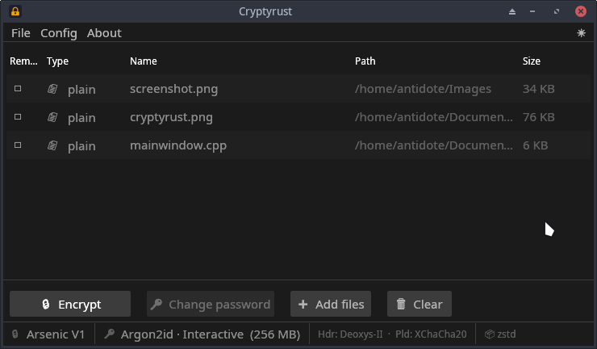

[](https://github.com/Antidote1911/cryptyrust/actions/workflows/ci.yml)
[](https://opensource.org/licenses/GPL-3.0)

# Cryptyrust

**Cross-platform file encryption with a drag-and-drop GUI and a CLI.**

Pre-built binaries for Linux, macOS (universal), and Windows are available on the [releases page](https://github.com/Antidote1911/cryptyrust/releases/latest).



---

## Table of Contents

- [Features](#features)
- [Project Structure](#project-structure)
- [GUI Usage](#gui-usage)
- [CLI Usage](#cli-usage)
- [Build Instructions](#build-instructions)
- [Data Loss Disclaimer](#data-loss-disclaimer)

---

## Features

- Encrypts any file with the **Arsenic V1** format (`.arsn`)
- **Drag-and-drop GUI** — drop files to encrypt or decrypt; mode is auto-detected
- **CLI** for scripting and automation
- Three selectable **AEAD ciphers** for header and payload, independently configurable
- **Argon2id** key derivation (Interactive 256 MB / Sensitive 1 GB)
- **Password change** without re-encrypting the payload
- Optional **zstd compression** before encryption
- Built-in **cipher benchmark** — finds the fastest cipher for your machine
- Cross-platform: Linux, Windows, macOS

---

## Project Structure

| Crate / Dir | Output | Description |
|---|---|---|
| [`arsenic/`](arsenic/) | — | Core cryptographic library — [README](arsenic/README.md) · [Format spec](arsenic/FORMAT.md) |
| [`cli/`](cli/) | `cryptyrust_cli` | Command-line interface |
| [`gui/`](gui/) | `cryptyrust` | Native GUI built with [egui](https://github.com/emilk/egui) |
| [`ffi/`](ffi/) | `libcryptyrust_ffi.so/.a` | C-compatible FFI layer |
| [`ffi_test/`](ffi_test/) | `arsenic_test` | Minimal C++ demo (encrypt / decrypt / bench) |

---

## GUI Usage

1. **Drag and drop** files onto the window — or click **Add files**.
2. Cryptyrust auto-detects the mode:
   - All files are `.arsn` → **Decrypt** mode
   - All files are plaintext → **Encrypt** mode
   - Mixed selection → a warning is shown; remove the odd files to proceed
3. Click **Encrypt** or **Decrypt**, enter your password (confirm on encryption).
4. To **change the password** of a single `.arsn` file, select it alone and click **Change password**.

### Configuration

Open the **Config** menu to adjust encryption settings:

| Setting | Options | Default |
|---|---|---|
| Argon2id strength | Interactive (256 MB) · Sensitive (1 GB) | Interactive |
| Header cipher | Deoxys-II-256 · AES-256-GCM-SIV · XChaCha20-Poly1305 | Deoxys-II-256 |
| Payload cipher | XChaCha20-Poly1305 · AES-256-GCM-SIV · Deoxys-II-256 | XChaCha20-Poly1305 |
| Compression | zstd level 3 | Disabled |

The status bar always shows the active configuration. Settings are persisted between sessions.

Click **⏱ Benchmark ciphers…** to measure throughput on your machine and apply the fastest combination automatically.

---

## CLI Usage

```bash
# Encrypt
cryptyrust_cli -e secret.pdf -p "my passphrase"

# Decrypt
cryptyrust_cli -d secret.pdf.arsn -p "my passphrase"

# Change password in-place
cryptyrust_cli --rekey secret.pdf.arsn

# Benchmark ciphers
cryptyrust_cli --bench
```

```
Options:
  -e, --encrypt <FILE>         File to encrypt
  -d, --decrypt <FILE>         File to decrypt
  -k, --rekey <FILE>           Change password of an encrypted file in-place
      --bench                  Benchmark AEAD cipher throughput on this machine
  -o, --output <PATH>          Output file
  -p, --password <PASSWORD>    Password
  -f, --passwordfile <FILE>    Read password from a file (UTF-8)
      --strength <STRENGTH>    interactive (default) | sensitive
      --hdr-cipher <CIPHER>    deoxys-ii (default) | xchacha20 | aes-gcm-siv
      --pld-cipher <CIPHER>    xchacha20 (default) | deoxys-ii | aes-gcm-siv
```

---

## Build Instructions

### Prerequisites

- [Rust toolchain](https://rustup.rs/) (stable)
- **Linux only** — X11 / Wayland development packages:
  ```bash
  # Debian / Ubuntu
  sudo apt install libxcb-render0-dev libxcb-shape0-dev libxcb-xfixes0-dev \
                   libxkbcommon-dev libssl-dev pkg-config
  ```

### Build

```bash
cargo build --release
# CLI → target/release/cryptyrust_cli
# GUI → target/release/cryptyrust
```

### macOS universal binary

```bash
rustup target add x86_64-apple-darwin aarch64-apple-darwin
cargo build --release --target x86_64-apple-darwin
cargo build --release --target aarch64-apple-darwin
lipo -create target/x86_64-apple-darwin/release/cryptyrust \
             target/aarch64-apple-darwin/release/cryptyrust \
             -output cryptyrust_universal
```

### Windows

Install [Visual Studio Build Tools](https://visualstudio.microsoft.com/visual-cpp-build-tools/) with the **Desktop development with C++** workload, then:

```bat
cargo build --release
```

---

## Data Loss Disclaimer

If you lose or forget your password, **your data cannot be recovered.** There is no back door and no recovery mechanism. Use a password manager or keep a secure backup of your passphrase.

---

## Cryptographic library & format

All cryptographic logic lives in the [`arsenic`](arsenic/) crate.
See [`arsenic/README.md`](arsenic/README.md) for the API and [`arsenic/FORMAT.md`](arsenic/FORMAT.md) for the full Arsenic V1 binary format specification.
